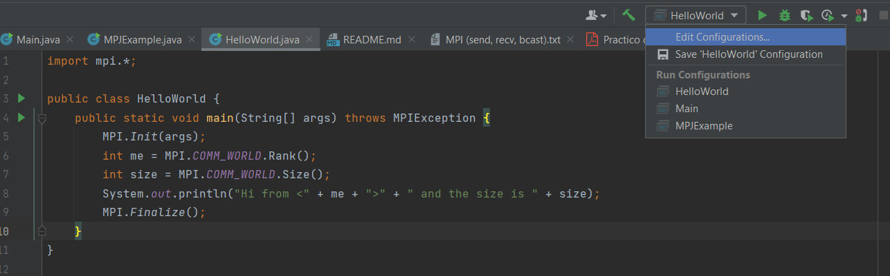
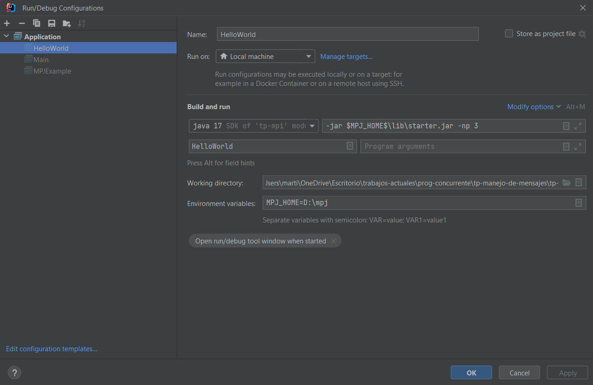
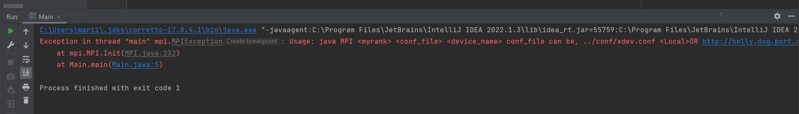

Para cada archivo Main que se haga se tiene que ir al "Edit Run Configuration" como indicaba el video:

https://www.youtube.com/watch?v=p_SUbcf0nCk

Sin eso no va a funcionar y les va a tirar error en rojito.

